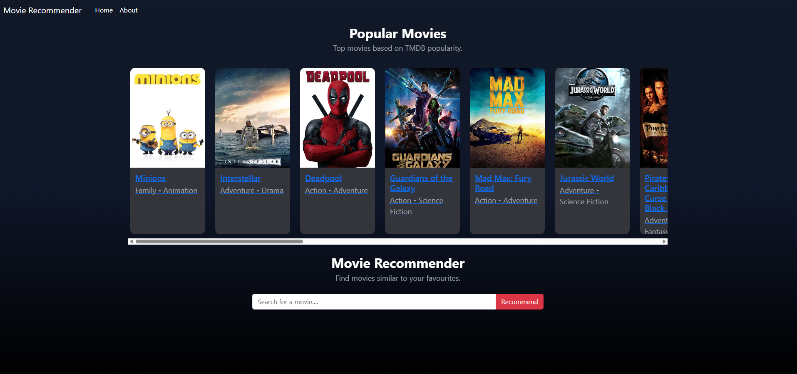
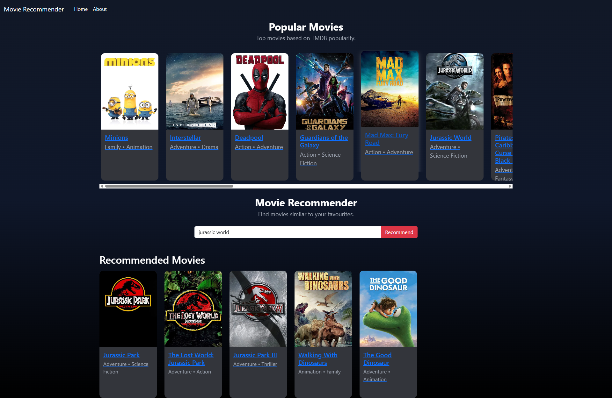
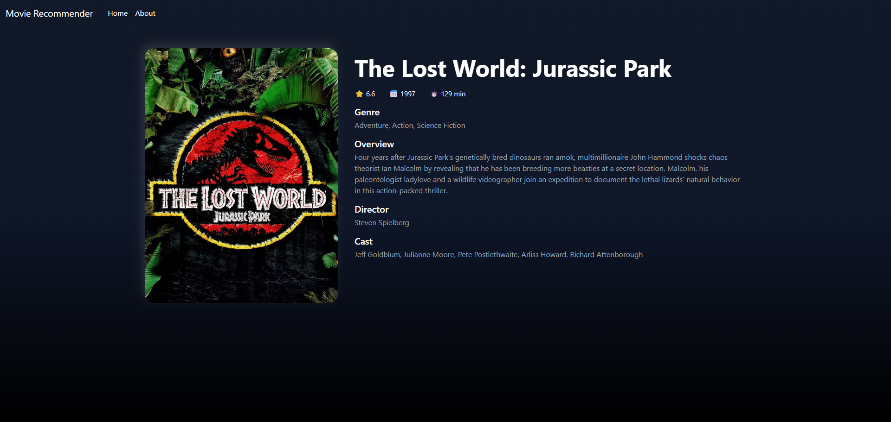
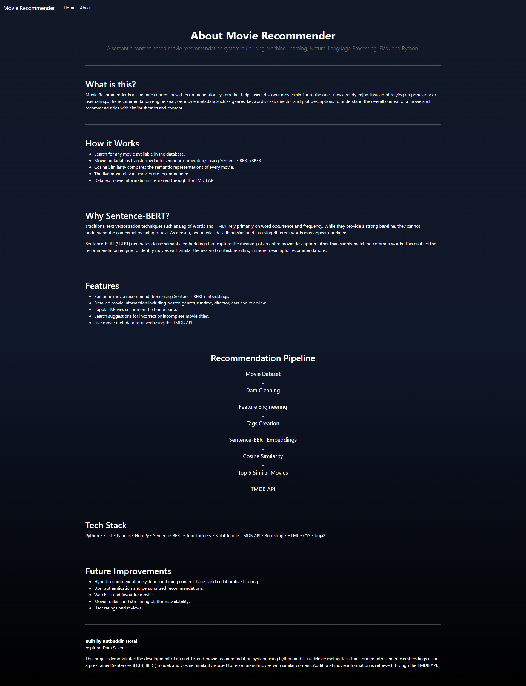
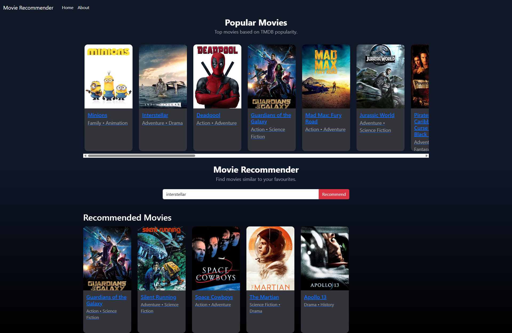
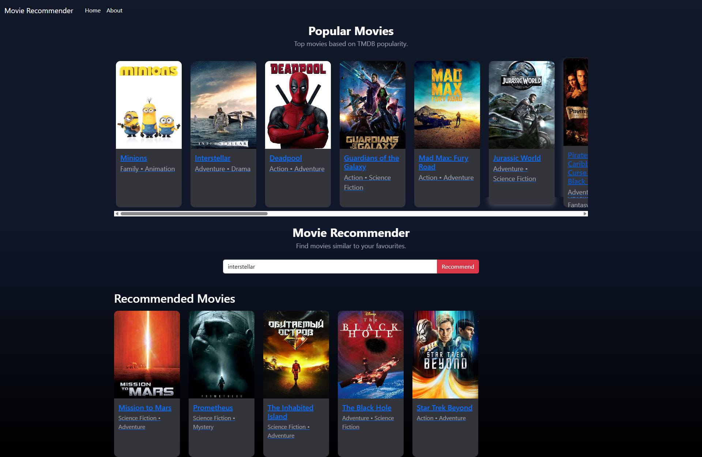

## Movie Recommender System

A content-based movie recommendation web application built using Python and Flask. The project recommends movies with similar content by comparing movie metadata such as genres, keywords, cast, crew, and plot descriptions. Movie details including posters, ratings, runtime, genres, and overview are fetched using the TMDB API.

The project initially used the Bag of Words approach for vectorization and was later improved using Sentence-BERT (SBERT) embeddings to capture semantic similarity between movies.

---

### Demo

https://movie-recommender-n3ze.onrender.com/

---

### Features

- Search for movies from the dataset
- Get the top 5 similar movie recommendations
- Semantic recommendations using Sentence-BERT (SBERT)
- Live movie posters and details using the TMDB API
- Dedicated movie details page
- Popular Movies section on the home page
- Search suggestions while typing
- Responsive user interface built with Bootstrap

---

### Project Workflow

1. Load the TMDB movie and credits datasets.
2. Clean and preprocess the data.
3. Extract useful metadata including:
   - Genres
   - Keywords
   - Top Cast
   - Director
   - Movie Overview
4. Combine the extracted information into a single text feature (`tags`).
5. Generate sentence embeddings using the pre-trained SBERT model.
6. Compute cosine similarity between movie embeddings.
7. Recommend the five most similar movies.
8. Fetch movie posters and additional details using the TMDB API.
9. Display the results through a Flask web application.

---

### Why SBERT?

The project was first implemented using the Bag of Words approach. While it worked well for keyword matching, it treated documents as collections of individual words and could not capture the contextual meaning of text.

The recommendation engine was later upgraded to Sentence-BERT (SBERT), which generates semantic embeddings for complete movie descriptions. This allows recommendations to be based on overall meaning rather than only matching words, resulting in more relevant recommendations.

---

### Tech Stack

#### Programming Language

- Python

#### Machine Learning

- Sentence-BERT (SBERT)
- Scikit-learn
- Cosine Similarity

#### Data Processing

- Pandas
- NumPy

#### Web Framework

- Flask
- Jinja2

#### Frontend

- HTML
- CSS
- Bootstrap

#### External API

- TMDB API

---

## Project Structure

```text
Movie-Recommender-System/

├── app.py
├── requirements.txt
├── Procfile
├── README.md
├── .gitignore
├── .env.example
│
├── assets/
│   └── screenshots/
│       ├── home.png
│       ├── recommendations.png
│       ├── movie_details.png
│       ├── about.png
│       ├── recommendations_BoW.png
│       └── recommendations_SBERT.png
│
├── notebooks/
│   ├── Movie_Recommender_Bag_of_Words.ipynb
│   ├── Movie_Recommender_SBERT.ipynb
│   ├── PopularMovies_and_DataPreprocessing.ipynb
│   ├── tmdb_5000_movies.csv
│   └── tmdb_5000_credits.csv
│
├── static/
│   └── css/
│       └── style.css
│
├── templates/
│   ├── base.html
│   ├── index.html
│   ├── movie.html
│   └── about.html
│
├── new_df.pkl
├── popular_movies.pkl
└── similarity_SBERT.pkl
```

---

### Installation

#### Clone the repository

```bash
git clone https://github.com/your-username/Movie-Recommender.git
```

Move into the project directory.

```bash
cd Movie-Recommender
```

---

#### Create a virtual environment

Windows

```bash
python -m venv env
```

Activate it.

```bash
env\Scripts\activate
```

---

#### Install dependencies

```bash
pip install -r requirements.txt
```

---

#### Configure the TMDB API Key

Create a `.env` file in the project root.

```text
TMDB_API_KEY=YOUR_API_KEY
```

---

#### Run the application

```bash
python app.py
```

The application will be available at:

```
http://127.0.0.1:5000
```

---

### Screenshots

#### Home Page



#### Recommendations



#### Movie Details



#### About Page



---

### Recommendation Comparison

The recommendation system was initially implemented using the Bag of Words approach as a baseline and was later upgraded to Sentence-BERT (SBERT). The examples below illustrate how the choice of text representation influences the recommended movies.

#### Bag of Words



The Bag of Words approach represents each movie by the frequency of words in its metadata. Recommendations are primarily based on shared keywords, genres, and other overlapping terms. While this method is simple and effective, it may recommend movies that share similar words without fully capturing the overall context or theme.

#### Sentence-BERT (SBERT)



Sentence-BERT (SBERT) generates semantic embeddings that represent the overall meaning of a movie's metadata. Instead of relying only on common keywords, recommendations are based on contextual similarity, allowing movies with similar themes or concepts to be matched even when they do not share many exact words.

### Future Improvements

- User authentication
- Personalized recommendations
- Watchlist functionality
- User ratings and reviews
- Filtering by genre and release year
- Movie trailers and streaming platform information

---

### Dataset

- TMDB 5000 Movies Dataset
- TMDB 5000 Credits Dataset

---

### Acknowledgements

- TMDB for providing movie metadata through the TMDB API.
- Sentence Transformers for the pre-trained SBERT model used for semantic embeddings.

---

### Author

Kutbuddin Hotel

This project was developed as a portfolio project to learn and implement content-based recommendation systems using Python and Flask.